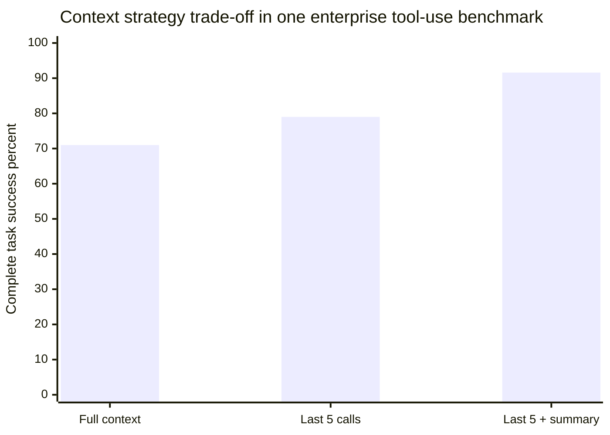
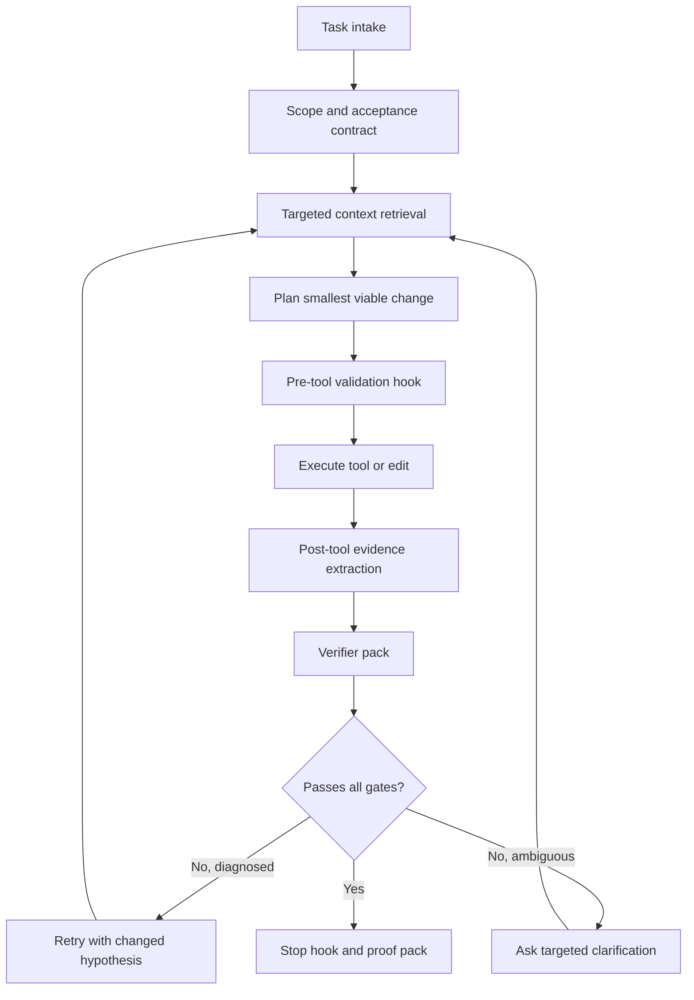

# Evidence-Based Design for Agentic LLM Workflows

## Executive Summary

The strongest practical conclusion from the uploaded papers and the recent literature is that **good agentic LLM systems are not primarily prompt artifacts; they are workflow systems**. The most reliable gains come from five moves that recur across the evidence: **selective context loading instead of full-history retention, verifier-first execution, narrowly scoped tools and skills, explicit collaboration rules, and structured state that survives compaction without turning into vague summaries**. Across recent studies, selective context engineering improves both cost and task quality, while overlong repository context files and indiscriminate tool/schema injection often make agents slower, more brittle, or both. citeturn0academia1turn0academia2turn0academia0turn6academia1turn11academia13

The uploaded PDFs sharpen that lesson in complementary ways. The Google behavior-taxonomy paper shows that developers overwhelmingly want agents to follow project workflows, understand context before acting, validate their own work, and communicate clearly with low-friction escalation to humans. The engineering case study shows that this is operationally achievable with a manager/planner/information backbone plus specialized tool agents, but it is still a **case study**, not a universal recipe. The “code quality” paper shows that functional correctness alone misses production-relevant dimensions such as input validation, maintainability, documentation, and error handling, while the “slop” paper shows that low-quality output is multi-dimensional, domain-specific, partly subjective, and poorly captured by current automated judges. fileciteturn0file3 fileciteturn0file2 fileciteturn0file0 fileciteturn0file1

For your stated goal—applying tested theory early to practical workflows—the safest current bet is a **bounded single-agent or shallow compound-agent architecture** with: a minimal rule file; a compact durable-state object; a retrieval layer that loads only the current working set; formal verification gates wherever possible; evidence logging for every meaningful claim; tool/skill allowlists; and stopping rules that require proof, not confidence. The evidence for this pattern is **moderate to strong**. The evidence for more ambitious ideas—self-evolving skill libraries, reversible memory systems, large multi-agent swarms, or LLM-only self-critique—is **emerging** and should be deployed behind measurement and rollback. citeturn6academia1turn0academia0turn4academia12turn2academia2turn5search0turn13academia0turn1academia1turn8academia3

A second major conclusion is that **interactivity should be deliberate, not constant**. Clarification helps when tool parameters are truly underspecified, and structured uncertainty methods improve coverage while asking fewer questions. But clarification also opens a real new attack surface: recent work shows that ambiguity-seeking states can sharply increase prompt-injection vulnerability. The right design is therefore not “always ask when uncertain,” but “ask only when the missing information changes the action materially, and sanitize the clarification channel like any other untrusted input.” citeturn2academia3turn2academia0

A third conclusion is that **determinism must be operationalized, not assumed**. Recent work shows that identical prompts can still yield different outputs or scores because of serving conditions, floating-point effects, and judge instability, even under ostensibly deterministic settings. In production, the meaningful target is not perfectly identical prose; it is **stable verified outcomes** produced by pinned models, schemas, tools, policies, seeds where available, and repeated-run evaluation on a fixed task suite. citeturn14academia3turn3academia0turn14academia1

Finally, the evidence strongly suggests that **“slop reduction” should be implemented as an output contract plus evidence discipline**, not as a vague instruction to “be concise.” The uploaded slop paper finds that relevance, density, tone, coherence, and factuality matter, but that binary slop judgments are somewhat subjective and that zero-shot frontier LLMs perform poorly at span-level slop identification. In practice, the best current control is to require answers to distinguish fact from inference, cite evidence, avoid generic framing, state unresolved uncertainty, and stop after the necessary proof pack is assembled. fileciteturn0file1 fileciteturn0file3

## Scope, Assumptions, and Evidence Base

This report synthesizes the **four uploaded PDFs** and recent papers published or released in roughly the last 12 months in arXiv, ACL Anthology, OpenReview, major conference proceedings, and comparable primary sources. Google Scholar is useful for discovery, but the citations below prioritize primary or official sources. The evidence base is strongest for **coding agents, function-calling agents, and enterprise-style tool workflows**. It is notably weaker for long-term autonomous self-improvement in production and for broad claims that generalize cleanly across domains. fileciteturn0file0 fileciteturn0file1 fileciteturn0file2 fileciteturn0file3 citeturn0academia0turn0academia1turn6academia1turn4academia12

The working default in this report is a **brownfield enterprise or mature open-source codebase**, because much of the recent evidence studies repository issue resolution, function calling over existing tools, or enterprise workflows with existing conventions and ground-truth expectations. The uploaded Google rule-taxonomy paper is explicitly enterprise-focused, and the engineering case study is a brownfield simulation-analysis workflow layered over existing tools rather than a greenfield autonomous application. fileciteturn0file3 fileciteturn0file2

The strength labels used below follow a simple operational rubric. **Strong** means multiple independent studies or convergent findings with measurable outcomes and credible datasets. **Moderate** means one strong empirical result plus supporting but not fully replicated evidence. **Emerging** means single-study, under-review, synthetic-heavy, or case-study evidence that is useful but not yet dependable enough to anchor non-reversible workflow decisions by itself. This grading is my synthesis of the evidence, not a claim made by any single paper.

The table below makes the key unspecified assumptions explicit and turns them into adjustable design parameters.

| Unspecified item | Working assumption | Adaptable range | Why it matters |
|---|---|---|---|
| Model family and exact version | One frontier coding/tool-use model as primary, one cheaper fallback model for routing or formatting | Frontier hosted, mid-tier hosted, or local/on-prem with smaller context | Impacts tool reliability, verifier quality, latency, and whether more logic must move into deterministic code |
| Codebase size | Brownfield repo with meaningful conventions and tests | Small: under 100 files; medium: 100–2,000 files; large: over 2,000 files | Changes context budget, retrieval granularity, and approval gates |
| Team size and roles | Small-to-medium engineering team with at least one reviewer | Solo, 2–8, or larger platform/governance team | Determines human escalation points and governance overhead |
| Deployment criticality | At least moderate production risk | Prototype, internal-only, customer-facing, or regulated/high-risk | Determines how strict the verifier chain and rollback plan must be |
| Tool surface | Mixed deterministic tools plus text-heavy responses | 5–20 tools per scoped agent; more only with retrieval | Context cost and selection reliability degrade quickly when tool surface is injected monolithically |
| Output requirement | Developer-facing technical output | Internal notes, patch proposal, pull request, deployable artifact | Affects slop controls, evidence depth, and CI requirements |

The evidence behind those defaults is especially strong for keeping project-level instructions minimal and task-relevant, because recent work finds that repository context files often add cost and can even reduce success rates, while a large-scale study of agent README files shows that such files are maintained like configuration code and often omit security and performance guardrails. citeturn6academia1turn6academia0

## Empirical Findings Across the Requested Themes

The most robust recent empirical pattern is that **more raw context is usually not better**. ContextBench evaluates 1,136 issue-resolution tasks across 66 repositories and shows that coding agents over-retrieve context, favor recall over precision, and often explore more files than they actually use. In one enterprise MCP workflow, “Less Context, Better Agents” finds that keeping only the last five tool exchanges plus a compact summary beats full-history retention on both complete task success and token usage. “The Complexity Trap” reaches a similar practical conclusion on SWE-bench Verified: simple masking of old observations can match or slightly beat LLM-generated summaries while dramatically reducing cost. Taken together, these studies support a **recent-window plus durable-state** architecture rather than a “keep everything” architecture. citeturn0academia0turn0academia1turn0academia2

The chart below visualizes the **within-study** trade-off reported in the enterprise tool-use benchmark from “Less Context, Better Agents.” It should not be compared directly to other benchmarks, but it is a useful concrete picture of how selective retention can beat full-history retention. citeturn0academia1



A closely related result is that **repository guidance should be short and operative**. “Evaluating AGENTS.md” finds that repository-level context files tend to reduce task success and raise inference cost by more than 20 percent, even though agents do follow the instructions they contain. “Agent READMEs” complements that result by showing that developers fill these files with build/run commands, implementation details, and architecture notes, but specify security and performance requirements much less often. The uploaded Google behavior paper points the same way: developers most often want workflow adherence, context gathering before acting, validation, and maintainable output—not essays about the repository. The practical implication is that rule files should privilege **commands, invariants, prohibited actions, approval gates, and local conventions**, not prose overviews. citeturn6academia1turn6academia0 fileciteturn0file3

On **token reduction beyond context pruning**, the evidence is more mixed. SkillReducer studies 55,315 skills and finds large amounts of non-actionable content, then shows that compressing descriptions and progressive disclosure of skill bodies reduces tokens while slightly improving functional quality. Minification of state-in-context coding agents reduces input tokens substantially, but with a nontrivial resolution-rate drop. AGORA and ACE argue that token-level compression often destroys action grammar or loses recoverability, and that agent contexts need **step-level or reversible compression** rather than generic text compression. This is promising, but still **emerging**: the safest near-term move is to compress **logs, explanations, and skill bodies**, not the core executable state or tool arguments. citeturn1academia3turn8academia0turn8academia1turn8academia3

On **skills, libraries, and reusable procedures**, the empirical signal is increasingly clear but still not mature enough to trust without governance. HASP shows that turning “skills” from advisory text into executable program functions that trigger at failure-prone states can materially improve agent performance. SAGE reports better completion with fewer interaction steps and fewer generated tokens when a skill library is incorporated into reinforcement learning for sequential tasks. Memento-Skills and SkillFoundry push this idea further by externalizing persistent skills into reusable files and building or evolving libraries over time. The most useful operational takeaway is narrow and practical: **encode repeated procedures as explicit, versioned, testable skill units with clear interfaces**, then allow them into the loop only after validation. Do not treat free-form “tips” as a reliable long-term memory mechanism. citeturn1academia0turn13academia0turn1academia1turn13academia3

That conclusion becomes even more important once **skill governance** is considered. A very recent large-scale security study finds that both standalone LLMs and agent frameworks frequently recommend nonexistent skill names, with hallucination rates around the mid-30-percent range and even higher on real developer questions. The systems also repeat the same fake names, which creates a practical supply-chain attack surface. The direct implication is that skill acquisition must be **registry-grounded and allowlisted**. The agent should never autonomously install a skill merely because a plausible-sounding name was produced in-context. citeturn5academia25

For **tool use and hooks**, the best-supported theme is tool-surface reduction plus dynamic retrieval. Dynamic Tool Dependency Retrieval improves function-calling success substantially over static retrieval by conditioning retrieval on evolving execution context. FuncBenchGen shows that multi-step tool use remains brittle as dependency depth rises and that simply restating prior variable values can deliver large gains on a controlled benchmark. IFEval-FC shows that even frontier function-calling models still fail basic formatting instructions embedded in tool schemas. Together, these results strongly support three hook-level rules: **retrieve tools dynamically, restate critical state explicitly, and validate every argument against machine-checkable schema/policy rules before execution**. citeturn11academia13turn11academia14turn10academia15

For **interactivity**, the recent evidence supports a narrow form of asking questions. Structured uncertainty over tool parameters improves coverage while reducing unnecessary clarification relative to weaker baselines, and the uploaded Google enterprise taxonomy explicitly shows that developers want agents to seek help and clarification when needed. But ASPI shows that clarification-seeking can also amplify prompt-injection vulnerability by large margins across frontier models. The right design is therefore a **consequential-ambiguity policy**: ask only when the missing parameter changes the chosen tool, scope, side effects, or correctness; otherwise infer from local evidence and continue. Clarification itself must be treated as untrusted input and routed through the same sanitization and approval policy as tool returns. citeturn2academia3turn2academia0 fileciteturn0file3

For **verification, correctness, and hallucination reduction**, the evidence is strongest when the verifier is external and deterministic. The uploaded engineering case study explicitly used isolated testing of subtasks before integration and emphasized logging, error handling, stopping conditions, and multi-dimensional metrics. The uploaded code-quality paper gives a useful menu of software-engineering-oriented quality metrics—error handling, input validation, maintainability, style/structure, and documentation—and, importantly, shows that models do not reliably produce defensive programming behaviors unless those behaviors are elicited or rewarded. Recent verifier research reinforces the same point from the agent side: general LLM-based verification improves when criteria are decomposed and repeatedly scored, but step-level hallucination attribution remains hard, especially for tool-use hallucinations. Self-critique is therefore not enough; the workflow should rely first on compilers, tests, schema checks, policy engines, and external evidence, and only then on LLM verifiers. fileciteturn0file2 fileciteturn0file0 citeturn4academia12turn2academia2turn5search0turn3academia1

The uploaded “Measuring AI Slop in Text” paper is especially valuable for **slop reduction**, because it shows that slop is not a single defect. Across annotated news and question-answering passages, the strongest predictors of slop judgments included relevance, density, tone, factuality, and structure, and those predictors shifted by domain. Current automatic metrics and zero-shot LLM judges did not approximate human annotations well enough to replace them. That means “write less sloppily” is a poor control. A much better control is to specify architecture-level output constraints: direct answer first, evidence linked to each nontrivial claim, explicit uncertainty, bounded length, and no generic praise or repeated framing. The Google enterprise taxonomy points in the same direction by showing that developers often prefer clear, technical, low-fluff communication from agents. fileciteturn0file1 fileciteturn0file3

For **determinism**, the literature now makes two things very clear. First, identical inputs can still produce different internal probabilities, outputs, or evaluation scores because of serving-level nondeterminism and judge instability. Second, real system-level techniques such as verified speculation or invariant kernels can increase reproducibility, but only when the whole serving stack is engineered for it. For application builders, the actionable implication is simpler: pin the model and schema versions, normalize environment state, prefer structured outputs, run repeated evaluations on the same benchmark suite, and treat any LLM-based score as a noisy measurement rather than a single source of truth. citeturn14academia3turn3academia0turn14academia1

The synthesis below grades the requested themes by current evidence strength.

| Theme | Best recent evidence | Replication status | Evidence strength | Practical conclusion | Source |
|---|---|---|---|---|---|
| Token reduction and context compaction | Recent-window plus summary or masking often beats full-history retention | Convergent across multiple recent studies, but on different benchmarks | Moderate to strong | Keep a small working window plus durable state; do not keep entire histories | citeturn0academia1turn0academia2turn0academia0turn8academia3 |
| Minimal repo rule files | Repository context files often increase cost and can reduce success | Two complementary recent studies | Moderate | Keep rule files short, executable, and local-convention focused | citeturn6academia1turn6academia0 |
| Skill libraries | Reusable, executable skills can improve quality and reduce tokens | Mostly single-study or under-review, but convergent | Moderate | Version and test skills; promote only after replay/verifier checks | citeturn1academia0turn13academia0turn1academia1turn13academia3 |
| Hooks and tool gating | Dynamic retrieval, explicit state restatement, and schema validation improve tool use | Several recent papers, mixed benchmarks | Moderate | Build pre/post tool hooks around retrieval, validation, and evidence extraction | citeturn11academia13turn11academia14turn10academia15 |
| Interactivity | Clarification can help, but it also increases attack surface | Directly supported by recent task and security papers | Moderate | Ask only consequential questions and sanitize the clarification channel | citeturn2academia3turn2academia0 |
| Verification and hallucination reduction | Deterministic external verifiers outperform self-critique; LLM verifiers help when decomposed | Strong direction of agreement, weaker on generic LLM judges | Strong for external verifiers; moderate for LLM verifiers | Use compilers/tests/policy engines first, LLM verifier second | citeturn4academia12turn2academia2turn5search0turn3academia1 |
| Determinism | Repeated runs and judge scores vary even under “deterministic” settings | Multiple recent studies | Moderate | Target stable outcomes via pinned stacks and repeated-run evaluation | citeturn14academia3turn3academia0turn14academia1 |
| Slop reduction | Slop is multi-dimensional and current automation is weak | One strong uploaded study | Emerging to moderate | Enforce structure and evidence contracts instead of vague concision prompts | fileciteturn0file1 |
| Agent architectures | Specialized tool agents can help, but broad generalization is limited | One uploaded industrial case study plus supporting tool-use papers | Emerging to moderate | Prefer bounded single-agent or shallow compound designs over agent swarms | fileciteturn0file2 citeturn11academia13turn0academia0 |

## Evidence-Graded Design Patterns and Recommended Hooks

The recommended execution model below is the narrowest architecture that matches the best-supported evidence: a single primary agent or a shallow manager-plus-specialists pattern, with deterministic gates around every irreversible step. It reflects the uploaded engineering case study, the Google collaboration taxonomy, and the recent context, function-calling, and verification literature. fileciteturn0file2 fileciteturn0file3 citeturn0academia1turn11academia13turn4academia12



The design patterns below are the ones I would treat as the current default.

| Design pattern | What it means | Evidence grade | Why it is recommended | Source |
|---|---|---|---|---|
| Minimal rule file | Keep only commands, local conventions, guardrails, forbidden actions, and approval rules | A- | Recent studies show large repo context files often hurt more than they help | citeturn6academia1turn6academia0 |
| Recent window plus durable state | Store a compact structured state object outside the raw history | A- | Repeatedly supported by context-compaction studies | citeturn0academia1turn0academia2turn0academia0 |
| Tool-surface scoping | Give each specialist at most a small, relevant tool set; retrieve more only when needed | B+ | Helps both token economy and tool selection reliability | fileciteturn0file2 citeturn11academia13 |
| Verifier-first execution | Treat compilation, tests, schemas, policies, and plans as primary judges | A | Strongest current path to correctness and low hallucination rates | citeturn4academia12turn3academia1turn2academia2 |
| Executable skills, not prose habits | Turn repeated procedures into testable, versioned skill units | B | Multiple recent papers show gains, but replication is still limited | citeturn1academia0turn13academia0turn1academia1turn13academia3 |
| Consequential clarification only | Ask only when the missing info changes correctness, scope, or side effects | B+ | Clarification helps, but unnecessary questioning hurts flow and security | citeturn2academia3turn2academia0 |
| Low-slop output contract | Require direct answer, proof, uncertainty, and next action; forbid generic filler | B | Best supported by the uploaded slop and collaboration papers | fileciteturn0file1 fileciteturn0file3 |
| Human approval for irreversible/high-risk actions | Separate analysis from authority | A | Strong governance lesson across enterprise rules and safety papers | fileciteturn0file3 citeturn4search2turn2academia0 |

The recommended hooks should be implemented in code around the agent, not left entirely to the model. The evidence for each hook varies, but the overall pattern is well supported.

| Hook | Required checks | Artifact produced | Fail behavior | Evidence grade | Source |
|---|---|---|---|---|---|
| `pre_tool_call` | Tool allowlist, argument schema validation, policy check, risk class, approval requirement, unresolved parameter check | Tool call record with validated args | Block, ask targeted clarification, or escalate | A | citeturn10academia15turn4search2turn2academia3turn2academia0 |
| `post_tool_call` | Normalize output, extract durable facts, discard noisy spans, attach provenance | Evidence-ledger entries and compacted observation | Retry only with changed hypothesis | A- | citeturn0academia1turn0academia2turn4academia12 |
| `pre_context_load` | Rank files/tools by current objective, budget guard, duplicate suppression | Context request plan | Refine retrieval or narrow task | A- | citeturn0academia0turn11academia13 |
| `post_context_load` | Mark retrieved vs actually used context; detect over-retrieval | Context precision log | Tighten retrieval policy | B+ | citeturn0academia0 |
| `on_compaction` | Preserve facts, decisions, failed hypotheses, blockers, open questions, and hashes; never compress away acceptance criteria | Durable-state revision | Fall back to raw evidence if loss suspected | A- | citeturn0academia1turn8academia3turn8academia1 |
| `on_retry` | Require diagnosed failure class and changed plan; cap retries by class | Retry rationale and counter | Escalate or stop after budget exhausted | A- | citeturn4academia12turn2academia2turn9academia12 |
| `on_stop` | Acceptance checklist, verifier outputs, unresolved risks, rollback instructions | Proof pack | Refuse success claim without proof | A | fileciteturn0file2 citeturn3academia1 |

The anti-patterns are equally important. Based on the recent evidence, I would explicitly avoid the following defaults: full-history retention; giant AGENTS/README files; giant always-injected skill libraries; unconstrained self-critique loops; using an LLM judge as the only gate; assuming temperature-zero means deterministic behavior; autonomous skill installation; and clarifying every uncertainty without considering the attack surface. citeturn0academia1turn6academia1turn1academia3turn5search0turn14academia3turn5academia25turn2academia0

## Lifecycle Rule Set and Pre-Codebase Agent Operating System

The lifecycle below turns the evidence into enforceable rules from first analysis through rollback. It is intentionally heavier on scoping, evidence, and verification than on free-form reasoning, because that is where the strongest empirical support lies. fileciteturn0file2 fileciteturn0file3 citeturn4academia12turn3academia1

| Stage | Mandatory rules | Required artifacts | Exit criteria |
|---|---|---|---|
| Analysis | Restate goal, identify constraints, classify risk, list missing critical facts | Task contract draft | Goal, scope, and risk class are explicit |
| Planning | Propose smallest viable plan; identify tools, files, tests, and approval points | Plan with estimated evidence sources | Plan is reviewable and bounded |
| Scoping | Write explicit scope-in and scope-out; flag destructive actions | Scope file | No unresolved scope ambiguity remains |
| Specification | Convert request into acceptance tests, invariant checks, and “done” definition | Acceptance checklist | Success can be judged mechanically where possible |
| Evidence gathering | Read targeted context only; derive evidence ledger entries before acting | Evidence ledger | Each important claim has provenance |
| Implementation | Make smallest coherent change; preserve surrounding conventions | Patch set / branch | Change is localized and attributed |
| Testing | Run formatter, linter, unit tests, integration tests as appropriate; run policy checks | Verifier pack | All required gates pass or are explicitly waived |
| Deployment | Use staged rollout, canary, or equivalent; separate deploy authorization from authoring | Deploy plan and rollback plan | Approval and rollback path exist |
| Monitoring and rollback | Watch post-deploy signals; revert or gate further rollout on threshold breach | Runbook entries, alerts, rollback proof | System is either stable or rolled back cleanly |

A durable-state schema should be compact, semantically typed, and designed for compaction safety. The point is to keep **decision-critical memory**, not a miniature novel of the entire trajectory. The following schema is directly aligned with the recent context and verification evidence.

```yaml
task_id:
goal:
risk_class:
scope_in:
scope_out:
acceptance_criteria:
project_invariants:
assumptions:
confirmed_facts:
  - fact:
    evidence_ref:
decisions:
  - decision:
    rationale:
failed_hypotheses:
  - hypothesis:
    failure_signal:
open_questions:
recent_artifacts:
  changed_files: []
  generated_files: []
verification_status:
  format:
  compile:
  tests:
  policy:
  security:
next_best_action:
stop_readiness:
rollback_notes:
```

The **system prompt** should also be short and operational. The recent evidence does not support large philosophical prompt blocks. A practical skeleton looks like this:

```text
You are an engineering agent operating under verifier-first rules.

Primary objective:
- Satisfy the acceptance criteria with the smallest safe change.

Always:
- Retrieve targeted context before acting.
- Prefer deterministic tools and verifiers over internal judgment.
- Record evidence for every nontrivial claim.
- Preserve local conventions over generic style.
- Ask for clarification only when missing information changes correctness, scope, or side effects.
- State uncertainty explicitly.

Never:
- Claim success without verifier proof.
- Install skills/tools not on the allowlist.
- Perform irreversible actions without approval.
- Keep irrelevant history when a compact durable state suffices.
- Pad responses with generic praise, repetition, or unsupported summaries.
```

The **skill library** should be explicit, sparse, and versioned. Recent skill papers strongly suggest that routing metadata and progressive disclosure matter, while the security paper strongly suggests that acquisition must be registry-grounded. A useful skill manifest format is:

```yaml
name:
version:
owner:
approved: true
purpose:
when_to_use:
inputs:
outputs:
core_steps:
tests:
safety_constraints:
dependencies:
provenance:
```

The **verification hierarchy** should be fixed in advance, because ad hoc verification is exactly where hallucinations and variable-quality outcomes leak into the workflow.

| Level | Verifier type | Examples | Promotion criterion |
|---|---|---|---|
| Highest | Deterministic structural verifier | JSON schema, type checker, compiler, formatter, linter | Must pass |
| High | Behavioral verifier | Unit tests, integration tests, policy-as-code, static analysis | Must pass or receive explicit waiver |
| Medium | Environment verifier | `terraform plan`, database dry runs, API readback, sandbox execution | Must pass for deployable changes |
| Lower | LLM decomposed verifier | Requirement adherence, completeness, trace consistency | Advisory unless no harder verifier exists |
| Lowest | Pure self-critique | “Reflect on your answer” | Never sufficient by itself |

That hierarchy is especially important for infrastructure-oriented work. The recent verifier-first Terraform study splits failures into validation, plan, and policy stages and shows how much real quality signal comes from that decomposition. The general lesson transfers well beyond Terraform: **verifier staging localizes failure, makes retries actionable, and sharply reduces hand-wavy “looks good” judgments**. citeturn3academia1

The **token and retry budgets** should be explicit and class-based. Because the recent evidence shows that more thinking or more context can hurt, the retry budget should grow only when the verifier says the new attempt can plausibly win.

| Item | Default recommendation | Adaptable range | Rationale |
|---|---|---|---|
| Decision-time context budget | 12k–24k task tokens excluding static system prompt and schemas | 8k–32k based on repo size and model | Encourages precision over hoarding |
| Raw tool-response retention | Only the most recent few exchanges | 3–8 recent exchanges | Matches recent evidence better than full retention |
| Durable-state size | 0.5k–2k tokens | Up to 3k for complex tasks | Keeps summary focused |
| Retry budget for deterministic failure | 1–2 retries | 0–3 | More than this tends to loop unless evidence changes |
| Retry budget for ambiguity | 0 until clarification arrives | 1 after clarified input | Avoids guessing loops |
| Retry budget for policy/safety failure | 0 automatic retries | Human escalation only | Prevents policy erosion |
| Judge ensemble runs | 3 repeated evaluations for advisory LLM judging | 3–5 | Accounts for judge instability |

The **evidence ledger** sits at the center of the operating system. It is the bridge between compaction, determinism, and low-slop output.


A ledger entry should be tiny but strict:

```yaml
claim:
status: confirmed | inferred | unverified
evidence_ref:
source_type: tool | file | test | policy | human
retrieved_at:
hash_or_id:
notes:
```

The **governance and security controls** are no longer optional. They are part of basic competence for agentic workflows.

| Control | Why it exists | Minimum rule | Source |
|---|---|---|---|
| Tool allowlist | Reduces accidental or malicious tool expansion | No tool outside approved manifest | citeturn4search2turn11academia13 |
| Skill allowlist and registry grounding | Prevents hallucinated or hijacked skills | Exact registry lookup plus owner/version pinning | citeturn5academia25 |
| Clarification sanitization | Clarification can amplify prompt injection | Treat clarifications as untrusted input | citeturn2academia0 |
| Approval gates for irreversible actions | Prevents model-authorized damage | Human sign-off for deploy, delete, migrate, spend | fileciteturn0file3 citeturn4search2 |
| Full tracing and prompt/version logging | Required for debugging and auditability | Log model, prompt, tool I/O, and verifier results | fileciteturn0file2 |
| CI-enforced proof pack | Prevents unsupported success claims | Block merge without tests, policy checks, and evidence bundle | fileciteturn0file2 citeturn3academia1 |

The actionable **pre-codebase setup** below assumes the agent is not yet inside a repository and must create the operating system it will later use.

1. Create an `agent/` control directory containing `CHARTER.md`, `RULES.md`, `STATE_SCHEMA.yaml`, `SKILLS/`, `POLICIES/`, `EVIDENCE/`, `PROMPTS/`, and `EVAL/`.
2. Write `CHARTER.md` with the authority model: what the agent may do alone, what requires approval, and what it may never do.
3. Write `RULES.md` with only local conventions, commands, forbidden actions, and stop conditions. Do not write repository essays. This should resemble a project configuration file more than a narrative README. citeturn6academia1turn6academia0
4. Add `STATE_SCHEMA.yaml` exactly as a typed durable-state schema and ensure the runtime always updates it after compaction.
5. Create `POLICIES/tool_safety.yaml` and `POLICIES/approval_matrix.yaml` to classify tools and actions into read-only, reversible-write, irreversible-write, deploy, and external-spend classes.
6. Wrap every tool with `pre_tool_call` and `post_tool_call` middleware that validates arguments, classifies risk, and writes evidence-ledger entries.
7. Build `EVIDENCE/ledger.ndjson` as append-only and reference ledger entries from both the durable state and the final answer.
8. Define a `SKILLS/index.yaml` file, but start with only three to five proven skills such as repository scan, targeted test selection, diff inspection, deployment check, and policy check. Add no more until they have tests.
9. Create `PROMPTS/system.txt` and `PROMPTS/finalizer.txt`, keeping both short. The finalizer should enforce low-slop output structure: direct answer, proof, uncertainty, next action. fileciteturn0file1 fileciteturn0file3
10. Create a benchmark starter set in `EVAL/tasks.yaml` with roughly 20 representative tasks spanning bug fix, refactor, config edit, documentation update, and policy-constrained change. Run each across repeated trials when advisory LLM judging is involved. citeturn14academia1turn14academia3
11. Add CI checks that fail if the proof pack is missing, if policy checks fail, if the evidence ledger is inconsistent, or if the output claims deployment readiness without the appropriate verifier stages.
12. Only after those controls work should the agent be pointed at a real codebase. At that point, add repo-specific commands and invariants, then run a small calibration cycle before giving the agent broader autonomy.

## Key Paper Comparisons and Remaining Needed Materials

The uploaded papers are highly complementary and should be treated as foundational reference documents for your workflow design.

| Title | Year | Venue | Method | Main result | Practical implication | Access status | Source |
|---|---|---|---|---|---|---|---|
| From Correctness to Code Quality | 2026 | ISEC 2026 | 240 zero-shot solutions on 15 LeetCode problems, 4 models, 4 languages; introduces five SE quality metrics | Correctness is not enough; error handling, input validation, maintainability, style, and documentation expose blind spots | Use its metrics as CI-quality dimensions, but not as sole production benchmark | Uploaded PDF | fileciteturn0file0 |
| Measuring AI Slop in Text | 2026 | ICLR 2026 submission | Expert interviews plus span-level annotation over news and QA text | Slop is multi-dimensional and partly subjective; current automatic methods and zero-shot LLM judges are weak | Enforce output contracts and human review for quality-sensitive writing | Uploaded PDF | fileciteturn0file1 |
| Design Patterns for Compound Multi-Agent LLM Systems in Engineering | 2026 | Procedia CIRP | Design-science industrial case study with 63 ground-truth input/output pairs | Specialized tool agents plus planner/manager structure can work in a real workflow; logging and stop controls matter | Use as a concrete case-study template, not a general proof for multi-agent superiority | Uploaded PDF | fileciteturn0file2 |
| From Correctness to Collaboration | 2026 | CHI EA 2026 | Qualitative analysis of 91 enterprise agent-rule files | Developers want workflows, quality, effective problem solving, and good collaboration behaviors | Build agent rules around team norms and interaction quality, not correctness only | Uploaded PDF | fileciteturn0file3 |

The external papers below are the most relevant recent additions for the specific themes you asked about.

| Title | Year | Venue or status | Method | Main result | Practical implication | Access status | Source |
|---|---|---|---|---|---|---|---|
| ContextBench | 2026 | arXiv | 1,136 issue-resolution tasks, 66 repos, human gold contexts | Agents over-retrieve and under-use context | Measure context precision, not just retrieval recall | Open arXiv | citeturn0academia0 |
| Less Context, Better Agents | 2026 | arXiv | 50-task enterprise MCP benchmark, repeated runs | Recent-window plus summary beat full-history retention on success and tokens | Use selective retention and compact durable state | Open arXiv | citeturn0academia1 |
| The Complexity Trap | 2025 | arXiv | SWE-bench Verified comparison of masking vs summarization | Simple masking can halve cost while matching or beating summary-based context management | Prefer the simplest memory policy that preserves verifier performance | Open arXiv | citeturn0academia2 |
| Evaluating AGENTS.md | 2026 | arXiv | Coding-agent evaluation with repo context files | Repo context files often reduce success and increase cost | Keep rule files minimal and operative | Open arXiv | citeturn6academia1 |
| Agent READMEs | 2025 | arXiv | 2,303 agent context files from 1,925 repos | Context files behave like config code and often omit security/performance guardrails | Add explicit non-functional guardrails to agent rules | Open arXiv | citeturn6academia0 |
| SkillReducer | 2026 | arXiv | Large-scale analysis of 55,315 skills plus compression framework | Large parts of skill content are non-actionable; compression can improve quality | Build skills for routing and progressive disclosure | Open arXiv | citeturn1academia3 |
| Harnessing LLM Agents with Skill Programs | 2026 | arXiv | Executable program-function skills | Execution-time skill interventions outperform passive advice | Implement skill hooks as code, not prose | Open arXiv | citeturn1academia0 |
| Reinforcement Learning for Self-Improving Agent with Skill Library | 2025 | arXiv | Sequential skill-library RL on AppWorld | Better completion with fewer steps and tokens | Promote validated skills rather than retraining prompts endlessly | Open arXiv | citeturn13academia0 |
| Dynamic Tool Dependency Retrieval | 2025 | arXiv | Context-aware tool retrieval | Function-calling success improves over static retrieval | Retrieve tools dynamically as plans evolve | Open arXiv | citeturn11academia13 |
| IFEval-FC | 2025 | arXiv | 750 function-calling instruction tests | Frontier models still fail simple formatting constraints | Validate arguments and formats outside the model | Open arXiv | citeturn10academia15 |
| IRMA on τ-bench | 2025 | EMNLP Findings / arXiv | Input reformulation with domain rules and tool suggestions | Outperforms ReAct, function calling, and self-reflection on a dynamic tool benchmark | Add a pre-tool reformulation or planning layer for difficult domains | Open ACL + arXiv | citeturn5academia24turn4search1 |
| LLM-as-a-Verifier | 2026 | arXiv | General-purpose decomposed verification | Repeated, decomposed, fine-grained verification improves judge usefulness | Use decomposed LLM verification only after deterministic gates | Open arXiv | citeturn4academia12 |
| AgentHallu | 2026 | arXiv | 693 annotated agent trajectories, 5 domains | Step-level hallucination attribution is still hard, especially for tool use | Preserve step traces and tool arguments for diagnosis | Open arXiv | citeturn2academia2 |
| ASPI | 2026 | arXiv | 728 ambiguity-attack scenarios | Clarification-seeking increases prompt-injection vulnerability | Sanitize clarifications and minimize needless questions | Open arXiv | citeturn2academia0 |
| Skills That Don’t Exist | 2026 | arXiv | 15,000 prompts across 12 configs | Skill-name hallucination is common and exploitable | Never install skills without exact registry validation | Open arXiv | citeturn5academia25 |
| SafeToolBench | 2025 | EMNLP Findings | Prospective safety benchmark for tool use | Existing approaches do not fully capture pre-execution risk | Add prospective safety checks before tool execution | Open ACL | citeturn4search2 |
| Beyond Reproducibility | 2026 | arXiv | Systems study of token-probability nondeterminism | “Deterministic” runs still vary at the probability level | Measure repeated runs; do not trust single-run judge scores | Open arXiv | citeturn14academia3 |
| LLM-42 | 2026 | arXiv | Verified-speculation scheduling for deterministic inference | Determinism can be improved at the serving layer without disabling performance optimizations entirely | If you need reproducibility, treat it as an infrastructure problem too | Open arXiv | citeturn3academia0 |
| Writing Code vs. Shipping Code | 2026 | NBER | Telemetry study across >100,000 GitHub developers | AI increases coding activity much more than it increases releases | Treat review, CI, and deployment bottlenecks as first-class agent-design concerns | Open NBER working paper | citeturn7search6 |

The previously blocked papers you mentioned are no longer blocked for the core analysis, because the four most important ones are now uploaded and incorporated here. The remaining “needed” items are therefore not missing papers so much as **high-value artifacts and appendices** that would tighten implementation confidence:

| Priority | Material | Why it matters | Current status |
|---|---|---|---|
| Highest | Camera-ready or revised appendix for the uploaded slop paper | The paper is still marked under review; definitions and automatic metrics may shift | Nice-to-have, not required |
| High | Artifacts or raw run logs for Less Context, Better Agents | Useful for replicating the exact compaction policy in your own benchmark suite | Helpful for implementation |
| High | Supplementary details for LLM-as-a-Verifier | Needed to operationalize criteria decomposition cleanly in production | Helpful for verifier design |
| Medium | Benchmark/task pack for ContextBench | Useful if you want to test your own retrieval layer against gold context usage | Helpful for evaluation |
| Medium | SkillReducer or SkillFoundry artifacts | Useful if you want to build a governed skill-promotion pipeline instead of hand-curated skills | Helpful for skills pipeline |

The practical bottom line is straightforward. If an agent is about to autonomously build its own operating procedures before entering a codebase, it should first create the **rule file, durable-state schema, evidence ledger, tool/skill policy layer, verifier pack, and CI gates** described above. Only then should it be allowed to explore the repository and begin specialized skill accumulation. Recent evidence supports that sequence far better than the common alternative of “start with a huge prompt and let the agent figure it out.” citeturn6academia1turn0academia1turn4academia12turn5academia25turn4search2